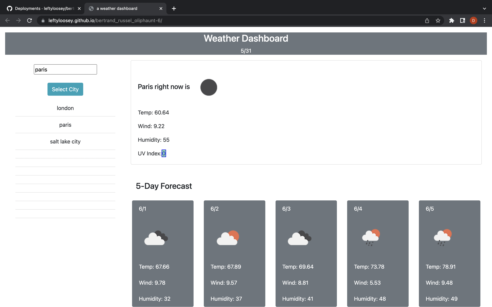

## Bienvenidos

It's an application that will tell you about the weather. Type in a city, click
select, and immediately (well, sometimes there is a bit of a lag. just wait)
is displayed the current conditions for that city, and also a five-day forecast.
Cute little icons provide a visualization. Clicking on a recently searched
city will re-display an updated screen. On mobile devices the display changes
from a dashboard layout to a long scrolling column.

Weather information supplied by the fine people at the openweather API. Other
than that it is a darling tiny feat of javascript and crude DOM querying and
CSS and Fetch API.

[index](https://leftyloosey.github.io/bertrand_russel_oliphaunt-6/)

